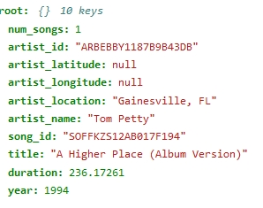
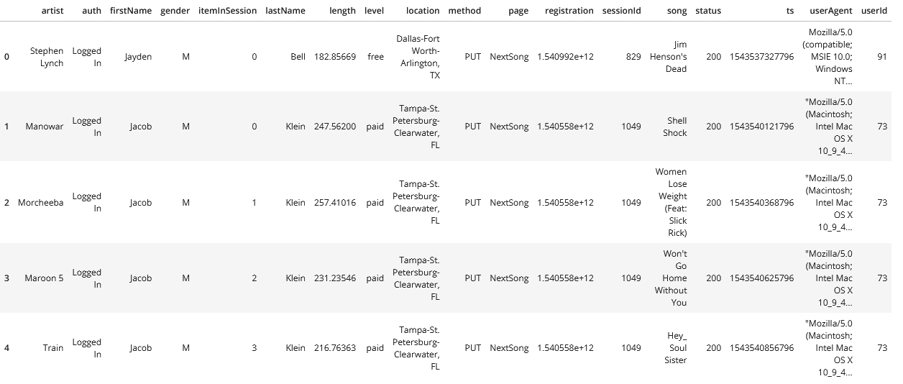
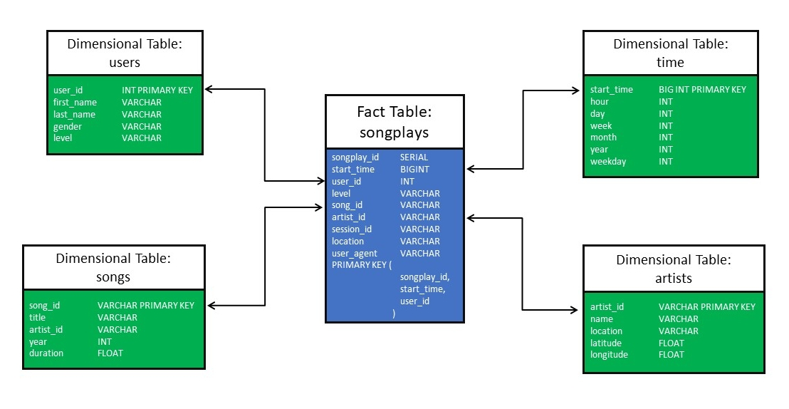
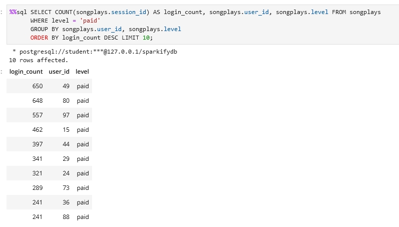
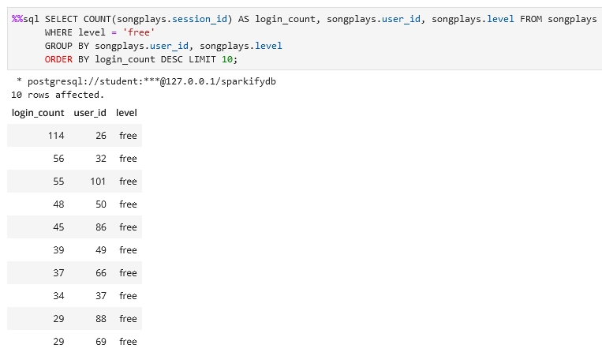

# Project 1 - Data Modelling with Postgres
*Tobias Tröger, January 2022*

## I - Project Description

The startup <em>Sparkify</em> has an music streaming app that generates a lot of data about their users activity. 
Currently the data analytics team want´s to get a deeper understanding of the listening habits of their users.
   
The data are records of user activity within the app and metadata about their preferred streamed songs. 
Both are available as JSON files in two separate folders.

   
Sparkify's analytics team needs a Postgres database optimized for analytical queries for the collected data. 
For this, a data engineer should create a schema for the appropriate database and the corresponding ETL pipeline.
   
## II - Running the Python Script's   
  
Both .py files that were provided for this project by Udacity reside in the main folder. These are <em>etl.py</em>
and <em>create_tables.py.</em> Both can be executed in the console with the following commands:

<em>python create_tables.py</em>

and

<em>python etl.py</em>
  
## III - Files and Data

### Files

The following six files are in the workspace:
  
1. `test.ipynb` checks if database and tables are created and displays the first 5 rows of each table.
2. `create_tables.py` creates and drops all tables. Has to be executed each time before you can run the ETL scripts.
3. `etl.ipynb` Contains instructions for the setup of the whole ETL process. Reads, processes a single file from <em>song_data</em>
    and <em>log_data</em> and loads the data in the corresponding tables.
4. `etl.py` contains the whole ETL pipeline based on the work of the <em>etl.ipynb</em> notebook. It reads, transforms and loads all data from both log     files in the 5 tables of our database.
5. `sql_queries.py` contains all SQL queries and is used by the 3 files above.
6. `README.md` gives an explanation of the project, the files it contains and the general procedure.

### Data and Song Logs

The song data consists of metadata about the song and its artist.
They are located in the folder <em>song_data</em> and are divided into further folders according to the first 3 letters of their ID.
The song data set is a subset of the [Million Song Dataset](http://millionsongdataset.com/).

An example of the raw data can be found below:

  

The user activity logs were also stored in JSON format. These are synthetic data sets generated with the help of an event simulator.
The data is located in the log_data folder and is sorted by month and year.

Below an example of the raw data:

  
## IV - Database Schema and ETL Pipeline

### Database Schema

To ensure efficient and fast queries, a denormalised star scheme was chosen. It contains the fact table <em>songplays</em> and the 4 dimensional tables <em>users, songs, artists and time</em>.

A schematic representation of the database schema can be found below:

### ETL Pipeline

The ETL pipeline (extract, transorm, load) was implemented as follows:

#### Extracting

The files with data were loaded from two directories: <em>data/song_data</em> and <em>data/log_data</em>.

#### Transforming and Loading

From the log and song data, 5 tables were generated using the ETL pipeline and stored in <em>sparkifydb</em>.

The sparkifydb database and the individual tables were generated using the functions in the file <em>create_tables.py</em>, and the SQL queries were then processed using the functions from etl.py. 

Finally, the transformed data is loaded into the individual tables using the functions from <em>etl.py</em>.

## V - Example Query

The two queries compare the frequency of app use between 'free' and 'paid' users.

